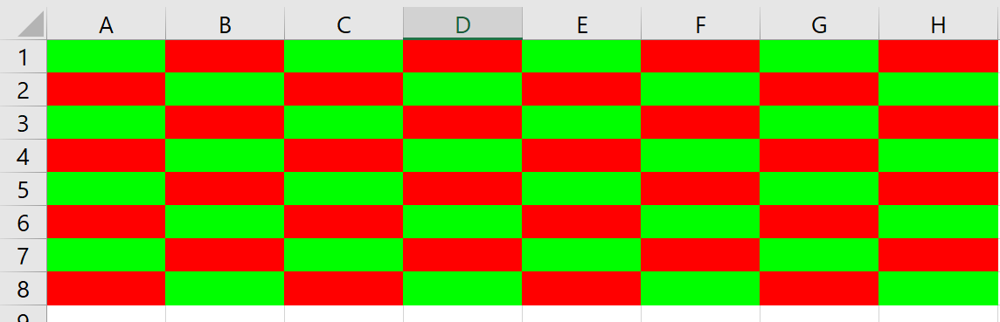
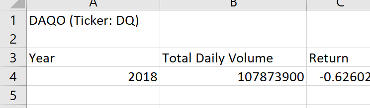
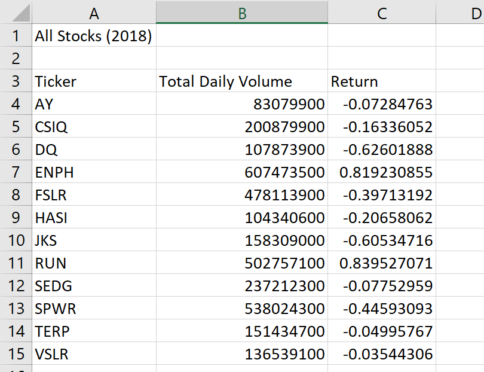
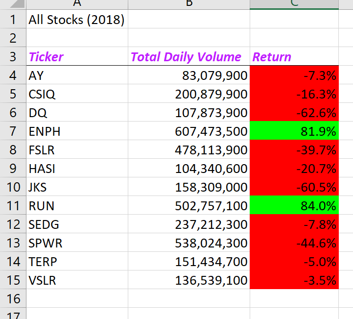
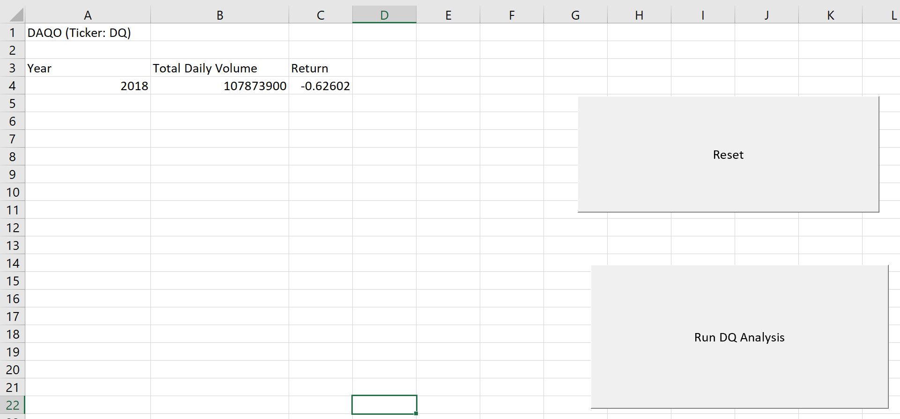
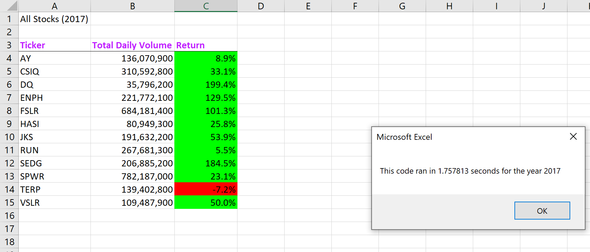
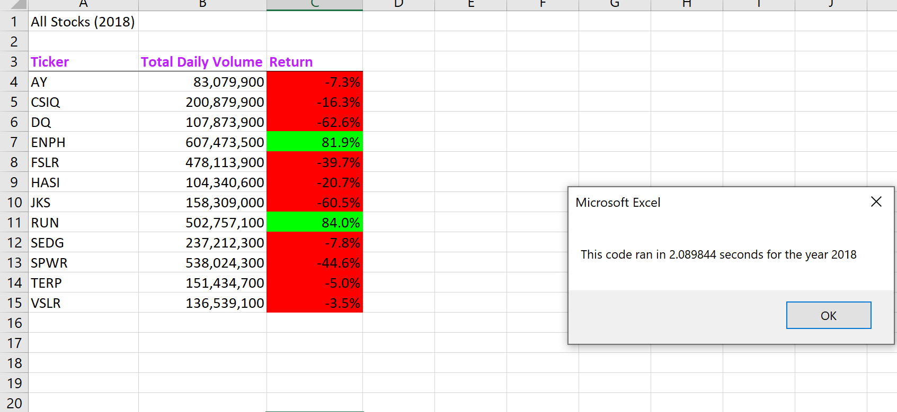
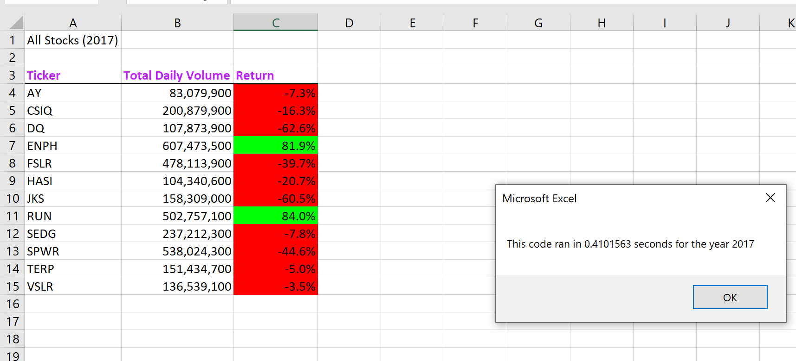
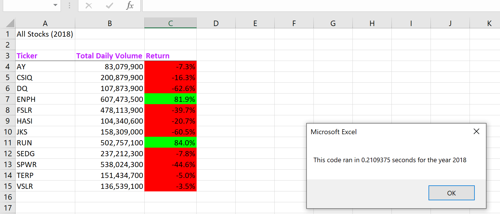

# **STOCK ANALYSIS USING _VBA_**

## Overview of Project
Steve wants to assist his parents to make wise financial decision as a finance expert(though newbie). He wants them to diversify their funds instead of putting all their money in DQ. He wants to achieve this by comparing the stock options of multiple green energies.

### Purpose
The purpose of the challenege is to work with steve on how to automate his tasks using Visual Basic for Application (VBA), a programming language that can work calculations and use complex budget to perform analysis. 

### Analysis and Challenges

The analysis was carried out by using code to automate analysis. Since multiple stocks are being considered, it will be a waste of time and effort and some likely errors to write a new code every time a new stock is being analyzed. Hence, VBA allows for the ***REUSE*** of the same code for different stock
 
 #### Challenges
 
 -The automated tasks are created in a macro, also known as, subroutine using the ***Sub*** function. It is important to enable macros on your excel worksheet before you get started.
  
			Sub MacroCheck()

   			 Dim testMessage As String

   			 testMessage = "Hello World!"

  			  MsgBox (testMessage)

			End Sub

-We defined our data types, depending on what type of data we are working with as Integer, Bolean, String, Single, Double.......befor creating our variable
  
-We create and activate the worksheet (running worksheet and output worksheet) to inform where the code will run in a multiple sheet file
 
-Adding comments before lines of code is very important to the code owner and any other person reading the code, because it helps to explain what is expected at every line and can also help to trace errors
***Whitespace***, is used to organize code, it includes the use of spaces, tabs, and line breaks
    
 -Using ***Loop***, we checked for how avtively DQ stock was traded in 2018. Loops tell a computer to repeat lines of code over and over (and over, and over) again and for loops tell the computer to repeat the lines of code a specific number of times

-Using ***Conditionals***, Conditionals tell the computer that certain lines of code should run only under certain conditions. The workhorse of conditionals is an if-then statement.
    
		Sub nesteddrill()

    Worksheets("nested drill").Activate
    
        'define variables
        rowNumber = 8
        colNumber = 8
        
        'Create a for loop from 1 to 8
        For i = 1 To rowNumber
            ' Use the modulus function to determine if a number is not divisible by 2 (odd number)
            For j = 1 To colNumber
        
                ' Use the modulus function to determine if a number is divisible by 2 (even number)
                If (i + j) Mod 2 = 0 Then
               'a line of code here will Change cell color to Green
                         Cells(i, j).Interior.Color = vbGreen
                Else
                'a line of code will Change cell color to red
                         Cells(i, j).Interior.Color = vbRed
           End If
           
        Next j
        
      Next i

End Sub

-To check for DQ's Yearly return for 2018, that is the is the percentage increase or decrease in price from the beginning of the year to the end of the year. In other words, if you invested in DQ at the beginning of the year and never sold, the yearly return is how much your investment grew or shrunk by the end of the year.
Our analysis shows that DAQO dropped over 63%  in 2018, this definitely does not ook good! Steve will want to offer some better stocks to his parents
  
  

- Since DAQO might not be the best option, Steve decidd to analyze multiple stocks, so we  run analyses on all of the stocks, we need to create a program flow that loops through all of the tickers and a nested Loop

- Using a ***For*** Loop and ***Array***, Instead of repeating our Daqo analysis code over and over and changing the bits that are stock-specific, we need to create a list of tickers and have VBA handle reusing the code. When using an array, An index of a variable is its position in the array. Almost all programming languages start their index at zero, which means that a variable at index 1 will be the second element in the list.

You use the ***Dim*** keyword to initialize an array but with a couple of key changes:

   -Insert a number in parentheses after the array name that represents the number of elements in the array.
   -Specify the type of variable for each element in the array.

-		Sub AllStocksAnalysis()
    'Format the output sheet on the "All Stock Analysis" worksheet
         Worksheets("All Stocks Analysis").Activate
           
           Range("A1").Value = "All Stocks (2018)"
           
           'create header rows
            Cells(3, 1).Value = "Ticker"
            Cells(3, 2).Value = "Total Daily Volume"
            Cells(3, 3).Value = "Return"
    
     'Initialize an array of all tickers.
        
            'Array to hold 12 Tickers
             Dim tickers(12) As String
             
             'Prepare for the analysis of tickers.
            tickers(0) = "AY"
            tickers(1) = "CSIQ"
            tickers(2) = "DQ"
            tickers(3) = "ENPH"
            tickers(4) = "FSLR"
            tickers(5) = "HASI"
            tickers(6) = "JKS"
            tickers(7) = "RUN"
            tickers(8) = "SEDG"
            tickers(9) = "SPWR"
            tickers(10) = "TERP"
            tickers(11) = "VSLR"
     
     
          
     'Initialize variables for the starting price and ending price.
     
        Dim startingPrice As Single
        Dim endingPrice As Single
        
     
     'Activate the data worksheet.
         Worksheets("2018").Activate
     
     'Find the number of rows to loop over.
        
        RowCount = Cells(Rows.Count, "A").End(xlUp).Row
        
     'Loop through the tickers.
        For i = 0 To 11
            ticker = tickers(i)
            totalVolume = 0
     
     'Loop through rows in the data.
        Worksheets("2018").Activate
        
        For j = 2 To RowCount
     
     'Find the total volume for the current ticker.
        If Cells(j, 1).Value = ticker Then
            
            totalVolume = totalVolume + Cells(j, 8).Value
            
        End If
     
     'Find the starting price for the current ticker.
        
        If Cells(j - 1, 1).Value <> ticker And Cells(j, 1).Value = ticker Then
            
            startingPrice = Cells(j, 6).Value
            
        End If
     
     'Find the ending price for the current ticker.
     
        If Cells(j + 1, 1).Value <> ticker And Cells(j, 1).Value = ticker Then
        
            endingPrice = Cells(j, 6).Value
        
        End If
    
    Next j
     
     
     'Output the data for the current ticker.
     
     Worksheets("All Stocks Analysis").Activate
     
        Cells(4 + i, 1).Value = ticker
        Cells(4 + i, 2).Value = totalVolume
        Cells(4 + i, 3).Value = endingPrice / startingPrice - 1
        
        
    Next i
   
End Sub

-SInce Steve is just starting his career, he might get another client that would be interested in a similar analysis, so the code can be reused. Debugging the code also helps to figure out where or what is off in the lines of code
       
- The code can be formatted using static or conditional formatting styles
       

- The fun part of this is the Run Button, which is easier and more user-friendly to run codes
     

      
- The code can also work for any Year by adding ***InputBox*** to store the value instead of re-writing a hardcode everytime to edit the year
      
- The code performance was measured how long the code takes to execute and output the elapsed time in a message box.This will help Steve in case he wants to run the code with a large dataset to determine how long it will take him

                    

### Summary

#### **The _advantages_  and _disadvantages_ of refactoring code in general**

The advantages include the following:

-Refactoring Improves the Design of Software
-Refactoring Makes Software Easier to Understand
-Refactoring Helps Finding Bugs
-Refactoring Helps Programming Faster

The disadvantages on the other hand is that,

-it might take the developer's time and 
-it could alter the original code and make it not explicit enough for someone reading the code for the first time

#### **The _advantages_ and _disadvantages_ of the original and refactored VBA script**

The advantages of refactoring the VBA script excecuted the code in a shorter time compared to the original script while, the refactoring made me re-write my original code to do the same as the refactored code, so that the basis of comparism can be valid, which is more like a disadvantage, because it was an extra effort.

                     

